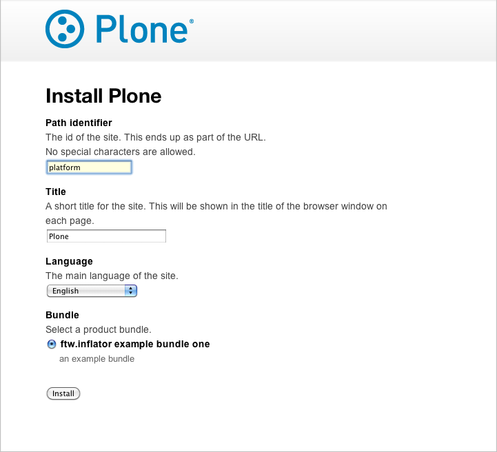

ftw.inflator
============

This packages helps predefining a Plone site setup including content
creation (using generic setup), defining multiple bundles and a wizard
for installing a new site with a bundle.

.. contents:: Table of Contents

Features
--------

- A simplified site setup wizard. The wizard can be customized and branded.
- A bundle system for defining variants in the setup configuration.
- A generic setup site creation import step which can be used in the bundles
  for creating initial content. It can be used without using the setup wizard
  and bundle system.

Installation
------------

- Add ``ftw.inflator`` to your buildout configuration:

.. code:: ini

    [instance]
    eggs +=
        ftw.inflator

Compatibility
-------------

Runs with `Plone <http://www.plone.org/>`_ `4.1`, `4.2` or `4.3`.

Setup wizard
------------

On the `manage_main` view of the Zope app there is an additional button
for installing your product.
It leads to the site setup wizard where an ID and a bundle can be selected.

The setup wizard allows to select one of a set of predefined bundles.
See the bundle section for details on how to define bundles.

Wizard customizations
~~~~~~~~~~~~~~~~~~~~~

The product name and logo can easily be customized through ZCML:

.. code:: xml

    <configure
        xmlns="http://namespaces.zope.org/zope"
        xmlns:inflator="http://namespaces.zope.org/inflator"
        i18n_domain="my.package">

        <include package="ftw.inflator" file="meta.zcml" />

        <inflator:customize
            product="Product Name"
            image="resources/product-logo.png"
            />

    </configure>

Bundle system
-------------

A bundle defines a list of profiles which are automatically applied when
creating a new Plone site with this bundle.

It has a base-profile (defaults to the Plone default base profile without
default content).

Defining bundles
~~~~~~~~~~~~~~~~

The bundles are defined in ZCML:

.. code:: xml

    <configure
        xmlns="http://namespaces.zope.org/zope"
        xmlns:inflator="http://namespaces.zope.org/inflator"
        i18n_domain="my.package">

        <include package="ftw.inflator" file="meta.zcml" />

        <inflator:bundle
            title="ftw.inflator example bundle one"
            profiles="plonetheme.sunburst:default
                      my.policy:default
                      my.policy:init-content"
            />

    </configure>

ZCML-Attributes
~~~~~~~~~~~~~~~

title
    The (translatable) title of the bundle, shown in the setup wizard.

profiles
    One or multiple Generic Setup profiles (without ``profile-``-prefix).

description (optional)
    The description of the bundle, shown in the setup wizard.

base (optional)
    The Generic Setup base profile for creating the plone site.
    This defaults to ``Products.CMFPlone:plone``, the default plone base
    profile without content creation.
    Using ``Products.CMFPlone:plone-content`` will generate the default
    example content.

standard (optional)
    By using the standard flag (``standard="True"``) you can define product bundles.
    When registering custom bundles later without flagging them as standard, they
    will appear above the standard bundles in the setup wizard and top is selected.

Full ZCML example:

.. code:: xml

    <configure
        xmlns="http://namespaces.zope.org/zope"
        xmlns:inflator="http://namespaces.zope.org/inflator"
        i18n_domain="ftw.inflator">

        <include package="ftw.inflator" file="meta.zcml" />

        <inflator:bundle
            title="MyProduct with sunburst"
            description="Installs MyProduct with the sunburst theme and plone default content"
            profiles="plonetheme.sunburst:default
                      my.product:default"
            base="Products.CMFPlone:plone-content"
            standard="True"
            />

    </configure>

Setting the language
~~~~~~~~~~~~~~~~~~~~

When installing a Plone site with the default add-site view, the language
is set in the ``Products.CMFPlone:plone-content``, which also creates example content.
This makes it hard to not create example content but setup the language correctly.

To solve this issue ``ftw.inflator`` provides a ``ftw.inflator:setup-language`` generic
setup profile, meant to be used while setting up a bundle.
You can add it to the list of bundle profiles.
Using it as a dependency (in ``metadata.xml``) is not recommended, since it is not meant
to be used on a existing plone site.

Example usage in bundle definition:

.. code:: xml

    <configure
        xmlns="http://namespaces.zope.org/zope"
        xmlns:inflator="http://namespaces.zope.org/inflator"
        i18n_domain="my.package">

        <include package="ftw.inflator" file="meta.zcml" />

        <inflator:bundle
            title="ftw.inflator example bundle one"
            profiles="ftw.inflator:setup-language
                      my.policy:default"
            />

    </configure>

Content creation
----------------

The content creation allows to define a ``content_creation`` folder in any
generic setup profile folder, containing JSON-files with definitions of the
content to create.

Content creation features
~~~~~~~~~~~~~~~~~~~~~~~~~

- JSON based definition
- construct instances of any archetypes FTIs
- add file- and image-fields
- create topic criterions
- execute workflow transition on creation
- create placeful workflow policies
- set properties
- set constraint types
- set per-object provided interfaces
- reindexing the catalog

Structure
~~~~~~~~~

Add a ``content_creation`` folder to your generic setup profile. All content
creation configurations are within this folder.
You can add as many ``*.json``-files as you want - they will be read
and executed in order of the sorted filename
(use integer prefixes for sorting them easily).

Folder creation example
~~~~~~~~~~~~~~~~~~~~~~~

For creating content create a JSON file (
e.g. ``profiles/default/content_creation/01-foo-folder.json``) and insert a
JSON syntax list of hashes (dicts).
Each hash creates a new object.
Example creating a folder with title "Foo" at ``/Plone/foo``:

.. code:: json

    [
        {
            "_path": "foo",
            "_type": "Folder",
            "title": "Foo"
        }
    ]

Creating / setting properties
~~~~~~~~~~~~~~~~~~~~~~~~~~~~~

Properties can easily be created.
If there already is a property (because the object already did exist), it is
updated.

Example:

.. code:: json

    [
        {
            "_path": "foo",
            "_type": "Folder",
            "title": "Foo",
            "_properties": {
                "layout": ["string", "folder_listing_view"]
            }
        }
    ]

Configuring constrain types
~~~~~~~~~~~~~~~~~~~~~~~~~~~

For configuring the addable types on a folder, use the ``_constrain_types``
keyword:

.. code:: json

    [
        {
            "_path": "foo",
            "_type": "Folder",
            "title": "Foo",
            "_constrain_types": {
                "locally": ["Folder", "Document"],
                "immediately": ["Folder"]
            }
        }
    ]

Provide additional interfaces
~~~~~~~~~~~~~~~~~~~~~~~~~~~~~

By passing a list of dottednames as ``_interfaces`` those interfaces will
automatically be provided (``alsoProvides``) by the created object:

.. code:: json

    [
        {
            "_path": "foo",
            "_type": "Folder",
            "title": "Foo",
            "_interfaces": [
                "ftw.inflator.tests.interfaces.IFoo",
                "remove:foo.bar.interfaces.IBar"
            ]
        }
    ]

By prefixing the dotted name with ``remove:``, directly provided interfaces
can be removed (``noLongerProvides``).

Files and images
~~~~~~~~~~~~~~~~

File- and image-fields can easily be filled by using the ``:file`` postfix,
providing a relative path to the file to "upload":

.. code:: json

    [
        {
            "_path": "files/example-file",
            "_type": "File",
            "title": "example file",
            "file:file": "files/examplefile.txt"
        }
    ]

Workflow transitions
~~~~~~~~~~~~~~~~~~~~

With the ``_transitions`` keyword it is possible to execute a workflow
transition upon content creation:

.. code:: json

    [
        {
            "_path": "foo",
            "_type": "Folder",
            "title": "Foo",
            "_transitions": "publish"
        }
    ]

Placeful workflow policies
~~~~~~~~~~~~~~~~~~~~~~~~~~

When placeful workflow policies are installed it is possible to activate them
on a folder using the ``_placefulworkflow`` keyword:

.. code:: json

      [
          {
              "_path": "intranet",
              "_type": "Folder",
              "title": "Intranet",
              "_placefulworkflow": ["intranet", "intranet"]
          }
      ]

You need to install the Generic Setup profile
``Products.CMFPlacefulWorkflow:CMFPlacefulWorkflow`` for using placeful workflow policies.

Annotations
~~~~~~~~~~~

With the ``_annotations`` it is possible to set simple annotations on the
object.
Values of type ``dict`` are converted to ``PersistentMapping``, those of
type ``list`` are converted to ``PersistentList`` recursively.
Example:

.. code:: json

      [
          {
              "_path": "intranet",
              "_type": "Folder",
              "title": "Intranet",
              "_annotations": {"foo": {"bar": [1, 2, 3]}}
          }
      ]

Links
-----

- Main github project repository: https://github.com/4teamwork/ftw.inflator
- Issue tracker: https://github.com/4teamwork/ftw.inflator/issues
- Package on pypi: http://pypi.python.org/pypi/ftw.inflator
- Continuous integration: https://jenkins.4teamwork.ch/search?q=ftw.inflator

Copyright
---------

This package is copyright by `4teamwork <http://www.4teamwork.ch/>`_.

``ftw.inflator`` is licensed under GNU General Public License, version 2.
